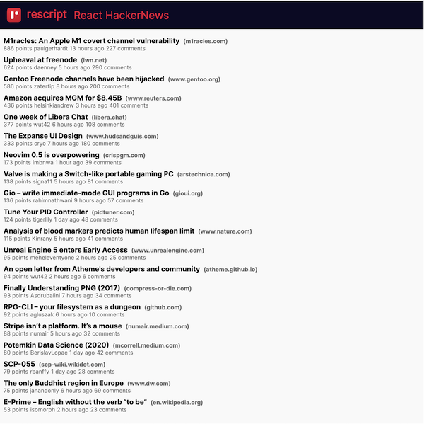
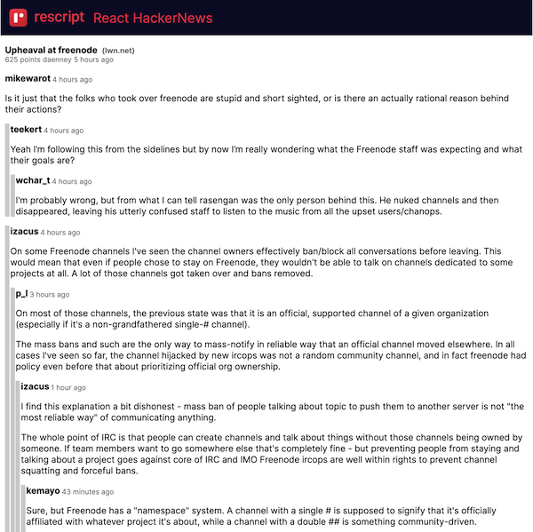

# HackerNews clone using ReScript and React

## Screenshots

**Listing**



**Comments**




## API

This project use an [Algoria REST API](https://hn.algolia.com/api). It is slow but works well.


## Installation

```bash
git clone https://github.com/ChangJoo-Park/hackernews-rescript
cd hackernews-rescript
npm install
npm run re:watch & npm run r:start
```
